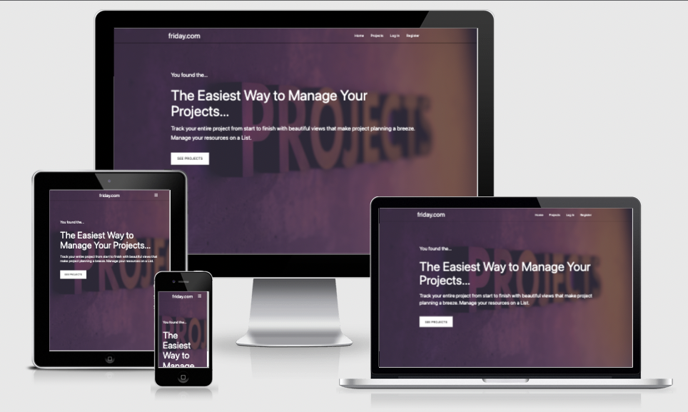
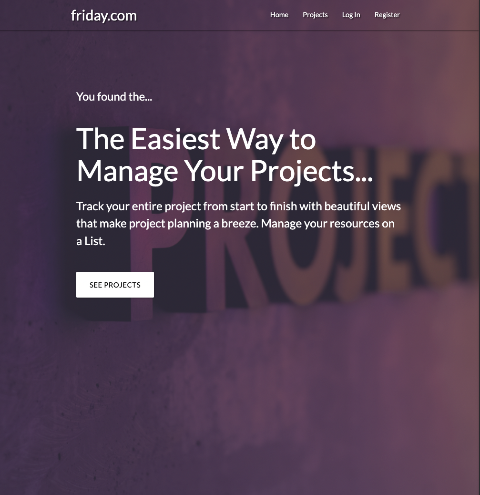
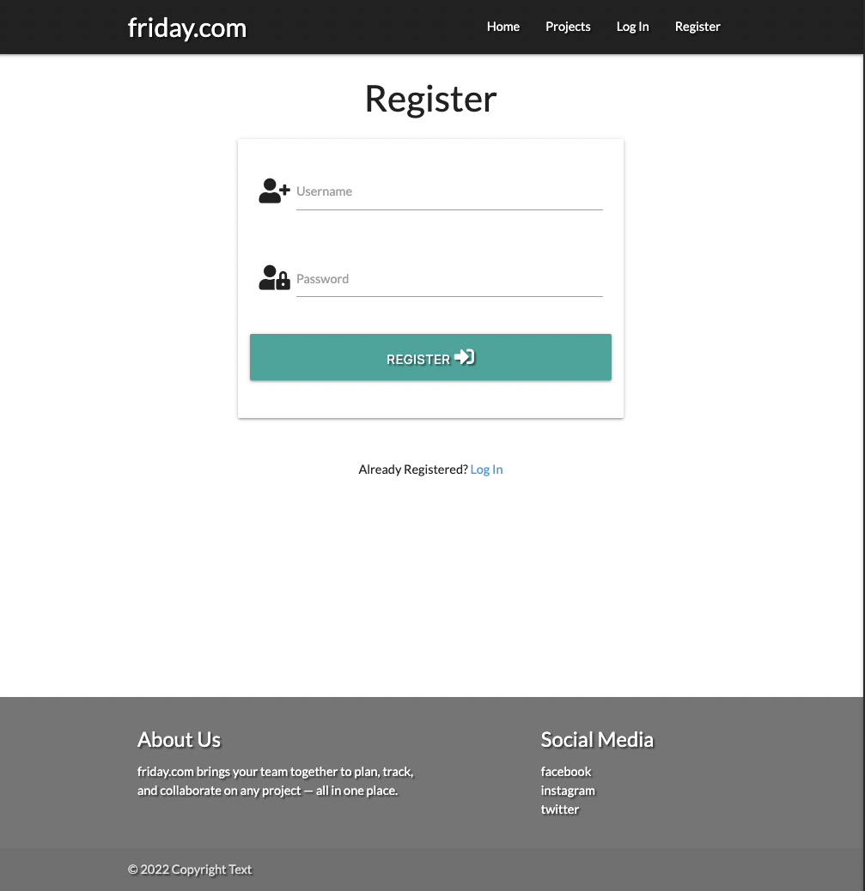
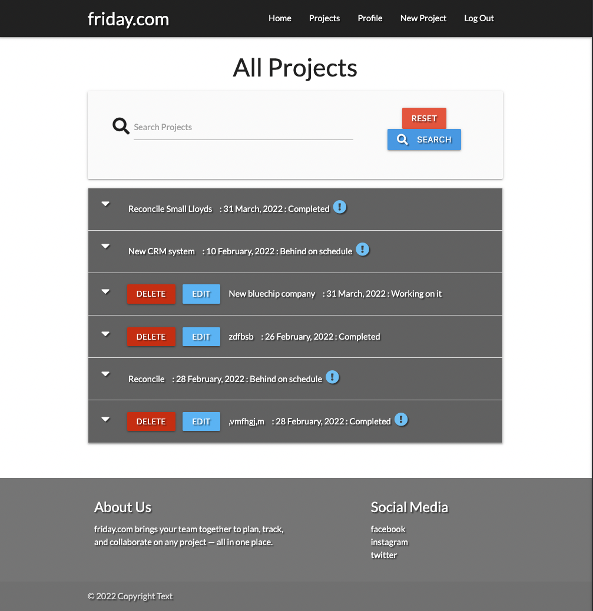
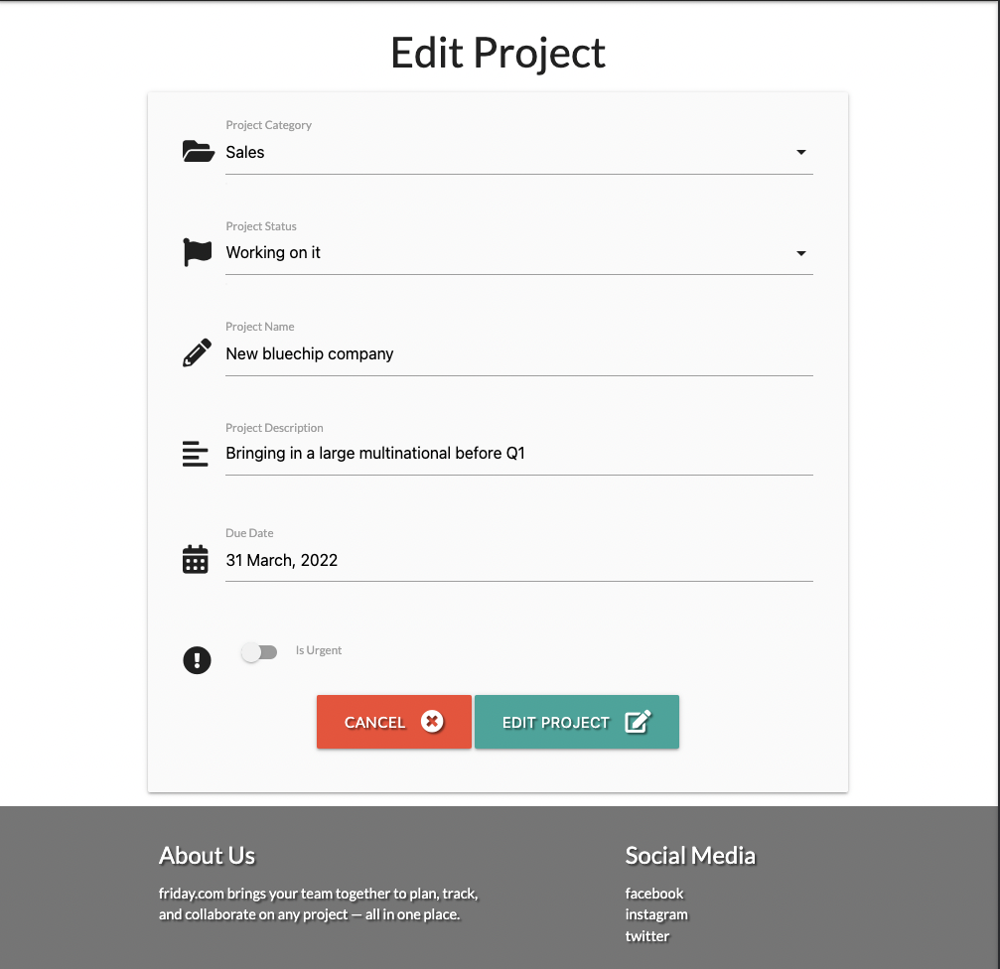
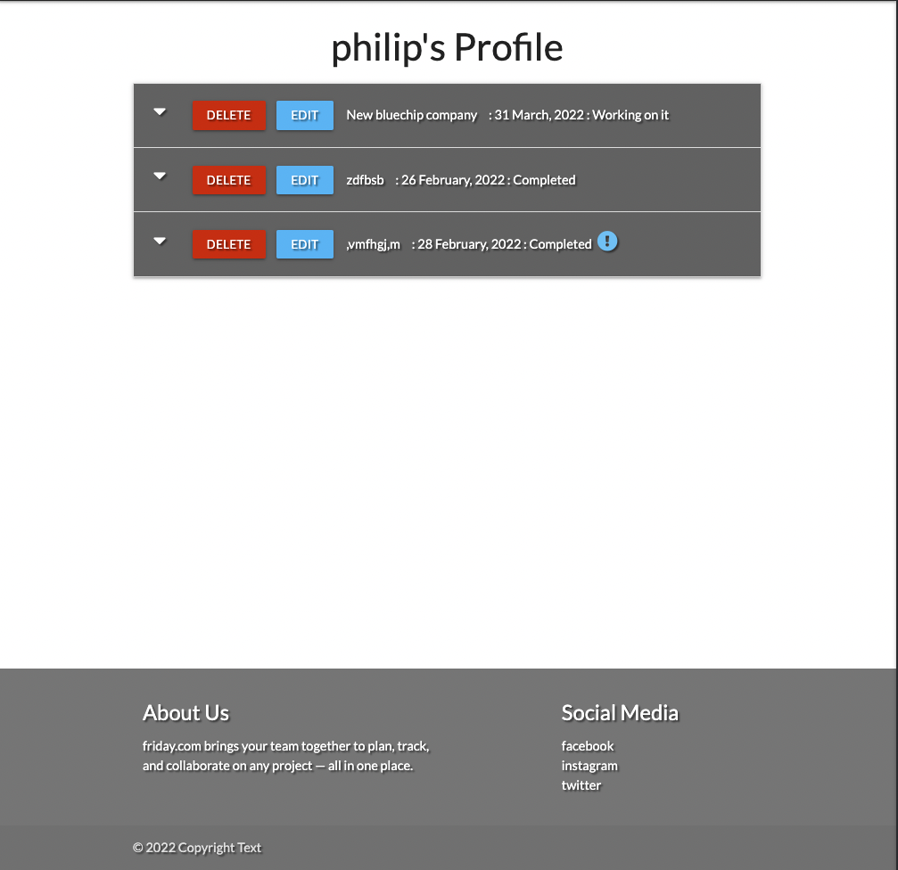

<h1 align="center">friday.com</h1>

[View the live project here.](https://friday-projects.herokuapp.com/)
### User Testing Creditals
#### Admin User 
    username = admin
    password = basketball13
#### Basic User 
    username = philip
    password = basketball

friday.com is a site where users can log projects for completion with full CRUD functionality, using recently learned Python and Flask.  


<h2 align="center"></h2>

## **CONTENTS** ##

- [UX](#user-experience-(ux))
- [Features](#features)
- [Technologies Used](#technologies-used)
- [Testing](#testing)
- [Known Bugs](#known-bugs)
- [Deployment](#deployment)
- [Content](#content)
- [Media](#media)
- [Acknowledgements](#acknowledgements)


## User Experience (UX)

-   ### Project goals
This site is aimed at teams who want a free resource that will help them in their workday. It is also a site where users can share their projects with other departments. 

-   ### User stories

    -   #### First Time Visitor Goals

        1. As a First Time Visitor, I want to know about the site. 
        2. As a First Time Visitor, I want to easily create an account. 
        3. As a First Time Visitor, I want to be able to log a project.

    -   #### Returning Visitor Goals

        1. As a Returning Visitor, I want to find information about projects.
        2. As a Returning Visitor, I want to be able to contact site owner. 
        3. As a Returning Visitor, I want to be able to edit or delete a project. 


    -   #### Frequent User Goals
        1. As a Frequent User, I want to able to change the status.
        1. As a Frequent User, I want to able to see my own projects. 

-   ### Design
    -   #### Colour Scheme
        -   The two main colours used are grey/black. 
    -   #### Typography
        -   The semi-rounded details of the letters give Lato a feeling of warmth, while the strong structure provides stability and seriousness.
    -   #### Imagery
        -   The extensive background hero image is designed to be striking and catch the user's attention. It also brings a modern look.
    -   #### Data Schema

        -   Using MongoDB provides many benefits in the development of this app. Its flexible schema makes it easy to evolve and store data in a way that is easy to work with. MongoDB is also built to scale up quickly and supports all the main features of modern databases such as transactions.
        
        - Categories

                {   
                    "_id": ObjectId
                    "category_name": String
                }

        - Users

                {   "first_name": String
                    "last_name": String
                    "username": String 
                    "password": String
                }

        - status

                {   
                    "_id": ObjectId
                    "status": String (PK)
                }

        - projects

                {
                    "_id": ObjectId
                    "category_name": String
                    "project_name": String
                    "project_description": String
                    "is_urgent": String 
                    "due_date": Date
                    "status_name": String
                }
                

        *   ### Wireframes

            -   Desktop Wireframe - [View](https://github.com/PhilipWilliams0/friday.com/tree/main/static/wireframes/desktop)

            -   Tablet  Wireframe - [View](https://github.com/PhilipWilliams0/friday.com/tree/main/static/wireframes/tablet)

            -   Mobile  Wireframe - [View](https://github.com/PhilipWilliams0/friday.com/tree/main/static/wireframes/mobile)

## Features
### Existing:

-   Responsive on all device sizes.
-   Hero image with text, call to action homepage.
-   Fixed and transparent navbar on every page.
-   Showing a footer on every page.
-   Multiply social contacts
-   Interactive elements also display links on whether the user is signed in or anonymous.

#### Projects Page
-   Header with page location.
-   Search functionality for all projects using category name, project name and project description.
-   Reset button to exit search function.
-   Collapsible sections with crucial info in the header. 
-   Indicator stating if the project is urgent.

#### Register Page
-   Header with page location
-   Enables the user to register or, if already registered, use the link to access the sign-in page. 
-   Button to register

#### Login Page
-   Header with page location
-   Enables the user to log in or, if not registered, use the link to access the registration page. 
-   Button to log in

#### Profile Page
-   Header with page location
-   User is greeted with a welcome message.
-   Collapsible sections with crucial info in the header. 
-   If a user created any project, those projects only would be listed in this section. 
-   Only created users will have edit/delete functionality.

#### New Product Page
-   Header with page location
-   User is presented with a clean form to enter all information for a new project. 
-   submit button
-   Message confirm project creation. 
-   Redirect to the all projects page. 

#### Log Out 
-   User has redirected all projects page with a message confirming logged out.

### To Implement
-   Use email service like emailjs or flask-mail rather then being transparent via social media.
-      

## Technologies Used

### Languages Used

-   [HTML5](https://en.wikipedia.org/wiki/HTML5)
-   [CSS3](https://en.wikipedia.org/wiki/Cascading_Style_Sheets)
-   [JavaScript](https://en.wikipedia.org/wiki/Cascading_Style_Sheets)
-   [Python3](https://en.wikipedia.org/wiki/Cascading_Style_Sheets)

### Frameworks, Libraries & Programs Used

1. [Flask:](https://flask.palletsprojects.com/en/2.0.x/)
    - Flask is a lightweight WSGI web application framework. It is designed to make getting started quick and easy, with the ability to scale up to complex applications. It began as a simple wrapper around Werkzeug and Jinja and has become one of the most popular Python web application frameworks.
1. [MongoDB:](https://www.mongodb.com/)
    - MongoDB is a source-available cross-platform document-oriented database program. Classified as a NoSQL database program, MongoDB uses JSON-like documents with optional schemas.
1. [Materialize 1.0.0:](https://materializecss.com/)
    - Materialize is a UI component library created with CSS, JavaScript, and HTML. Materialize UI components help in constructing attractive, consistent, and functional web pages and web apps, while adhering to modern web design principles such as browser portability, device independence, and graceful degradation.
1. [Font Awesome:](https://fontawesome.com/)
    - Font Awesome was used on all pages throughout the website to add icons for aesthetic and UX purposes.
1. [jQuery:](https://jquery.com/)
    - jQuery came with Bootstrap to make the navbar responsive but was also used for the smooth scroll function in JavaScript.
1. [Git](https://git-scm.com/)
    - Git was used for version control by utilizing the Gitpod terminal to commit to Git and Push to GitHub.
1. [GitHub:](https://github.com/)
    - GitHub is used to store the projects code after being pushed from Git.
1. [Heroku:](https://www.heroku.com)
    - Heroku is a platform as a service (PaaS) that enables developers to build, run, and operate applications entirely in the cloud.
1. [Balsamiq:](https://balsamiq.com/)
    - Balsamiq was used to create the [wireframes](https://github.com/PhilipWilliams0/friday.com/tree/main/static/wireframes) during the design process.

## Testing

The W3C Markup Validator W3C CSS Validator Services, including jshint and PEP8, were used to validate every page of the project to ensure there were no syntax errors.

-   [W3C Markup Validator](https://jigsaw.w3.org/css-validator/#validate_by_input) - [Results](https://github.com/PhilipWilliams0/friday.com/blob/main/static/img/testing/login_html.png)
    - All pages were checked, and the same warning came up for each page Warning: Section lacks heading. Consider using h2-h6 elements to add identifying headings to all sections. From line 49, column 5; to line 49, column 13 der>↩↩ <section>↩ 
-   [W3C CSS Validator](https://jigsaw.w3.org/css-validator/#validate_by_input) - [Results](https://github.com/PhilipWilliams0/friday.com/blob/main/static/img/testing/css.png)
    - No Errors
-   [jshint Validator](https://jshint.com/) - [Results](https://github.com/PhilipWilliams0/friday.com/blob/main/static/img/testing/JavaScript.png)
    - 2 ES6 errors on let
-   [PEP8 Validator](http://pep8online.com/) - [Results](https://github.com/PhilipWilliams0/friday.com/blob/main/static/img/testing/PEP8.png)
    - No Errors
### Testing User Stories from User Experience (UX) Section
 
- #### First Time Visitor Goals
    1. As a First Time Visitor, I want to know about the site. 
        <h2 align="center"></h2>
        1. Landing on the website tells you right away what the website does and has a button to see all open projects
    2. As a First Time Visitor, I want to easily create an account. 
        <h2 align="center"></h2>
        1. In the navigation bar, you have a link for registering where you are presented with a form to fill and register with input controls. Once submitted, you are signed and taken to a profile page with a successful message. 
    3. As a First Time Visitor, I want to be able to log a project.
        <h2 align="center"></h2>
        1. In the navigation bar, you have a link for a new project where you are presented with a form to fill in with input controls. Once submitted, taken to an all projects page with a successful message. 
 
- #### Returning Visitor Goals
    1. As a Returning Visitor, I want to find information about projects.
        <h2 align="center"></h2>
        1. As a returning user, you can select log in from the navbar. Which will open a login form with controls to all details are correct. Once logged in, they are taken to the profile page with a welcome message. 
    2. As a Returning Visitor, I want to be able to contact site owner. 
        <h2 align="center"></h2>
        2. Seeing sterling bank answer some queries via social media. I've decided to go without adding an email service and provide social media links instead. Transparency. 
    3. As a Returning Visitor, I want to be able to edit or delete a project. 
        <h2 align="center"></h2>
        3. The user has to be logged in and then from either the profile page or all projects, as long as the creator can edit projects using the edit button.
        4. The user has to be logged in and then from either the profile page or all projects, as long as the creator can delete projects using the delete button.
   
- #### Frequent User Goals
    1. As a Frequent User, I want to able to change the status.
        <h2 align="center"></h2>
        1. The user has to be logged in and then from either the profile page or all projects, as long as the creator can edit projects using the edit button.
    2. As a Frequent User, I want to able to see my own projects. 
        <h2 align="center"></h2>
        2. Once the user logs in, they are taken to the profile page, which will only show projects belonging to the user. 

### Further Testing

-   The Website was tested on Google Chrome, Internet Explorer, Microsoft Edge and Safari browsers.
-   The website was viewed on a variety of devices such as Desktop, Laptop, iPhone7, iPhone 8 & iPhoneX.
-   A large amount of testing was done to ensure that all pages were linking correctly.
-   Friends and family members were asked to review the site and documentation to point out any bugs and/or user experience issues.

### Known Bugs

-   flash messages don't appear on the redirected homepage
-   HTML - All pages were checked, and the same warning came up for each page Warning: Section lacks heading. Consider using h2-h6 elements to add identifying headings to all sections. From line 49, column 5; to line 49, column 13 der>↩↩ <section>↩ hasn't affected deployed.

## Deployment

### GitHub Pages

The project was deployed to GitHub Pages using the following steps...

1. Log in to GitHub and locate the [GitHub Repository](https://github.com/PhilipWilliams0/friday.com)
2. At the top of the Repository (not top of page), locate the "Settings" Button on the menu.
    - Alternatively Click [Here](https://raw.githubusercontent.com/) for a GIF demonstrating the process starting from Step 2.
3. Scroll down the Settings page until you locate the "GitHub Pages" Section.
4. Under "Source", click the dropdown called "None" and select "Master Branch".
5. The page will automatically refresh.
6. Scroll back down through the page to locate the now published site [link](https://github.com) in the "GitHub Pages" section.

### Forking the GitHub Repository

By forking the GitHub Repository we make a copy of the original repository on our GitHub account to view and/or make changes without affecting the original repository by using the following steps...

1. Log in to GitHub and locate the [GitHub Repository](https://github.com/)
2. At the top of the Repository (not top of page) just above the "Settings" Button on the menu, locate the "Fork" Button.
3. You should now have a copy of the original repository in your GitHub account.

### Making a Local Clone

1. Log in to GitHub and locate the [GitHub Repository](https://github.com/)
2. Under the repository name, click "Clone or download".
3. To clone the repository using HTTPS, under "Clone with HTTPS", copy the link.
4. Open Git Bash
5. Change the current working directory to the location where you want the cloned directory to be made.
6. Type `git clone`, and then paste the URL you copied in Step 3.

```
$ git clone https://github.com/PhilipWilliams0/friday.com
```

7. Press Enter. Your local clone will be created.

```
$ git clone https://github.com/PhilipWilliams0/friday.com
> Cloning into 'friday.com'...
> remote: Enumerating objects: 287, done.
> remote: Counting objects: 100% (287/287), done.
> remote: Compressing objects: 100% (201/201), done.
> remote: Total 287 (delta 146), reused 206 (delta 67), pack-reused 0
> Receiving objects: 100% (287/287), 4.68 MiB | 5.25 MiB/s, done.
> Resolving deltas: 100% (146/146), done.
```

Click [Here](https://help.github.com/en/github/creating-cloning-and-archiving-repositories/cloning-a-repository#cloning-a-repository-to-github-desktop) to retrieve pictures for some of the buttons and more detailed explanations of the above process.

## Create MongoDB database
My data was stored in a [MongoDB](https://cloud.mongodb.com/) collection set up using the following steps.
- Sign up / Sign In to mongodb and create a new cluster.
- Select 'collections' from the cluster dashboard.
- Click 'create database', and create database name and collection name.
- Click 'create collection' for any additional data collections needed for the app.

## Create Flask Application and install pymongo
In the terminal type the following commands to install the required packages:
    
- The following command will install the packages according to the configuration file
    ```
    $ pip3 install -r requirements.txt
    ```

Setup app
- Create `app.py` and `env.py` using the terminal
    ```
    touch app.py
    touch env.py
    ```

- Create gitignore file using the terminal to keep `env.py `from being pushed to github
    ```
    touch env.py
    ```

- Within the gitignore file add `env.py` and `__pycache__/`.
    ```
    env.py
    __pycache__/
    ```

Set up environment variables and flask instance
- Within `env.py` add the following environment variables:

    ```
    os.environ.setdefault("IP", "0.0.0.0")
    os.environ.setdefault("PORT", "5000")
    os.environ.setdefault("SECRET_KEY", "YOUR SECRET KEY")
    os.environ.setdefault("MONGO_URI", "YOUR MONGO URI")
    os.environ.setdefault("MONGO_DBNAME", "YOUR DATABASE NAME")
    ```

    - I used [randomkeygen]() to generate my secret key. 
    - To get your mongodb URI, go to your cluster dashboard and hit connect. Select your version of python and copy the string to the clipboard.

## Setting up the heroku app
In order to deploy the app via [heroku](https://dashboard.heroku.com/apps), the following steps must be taken. 

- In the terminal, create requirements.txt and Procfile for Heroku to run correctly
    ```
    pip3 freeze --local > requirements.txt
    ```
    ```
    echo web: python app.py > Procfile
    ```
- Push your files to gitHub
- Navigate to [heroku](https://heroku.com/) and create a new app in your dashboard.
- Assign an app name and region and hit 'create app'.
- In your dashboard, click to connect your gitHub and then locate the correct repository to be deployed.
- Click on the settings tab and then click 'reveal config vars' in order to input the data hidden in `env.py` as follows.
        
        IP                  0.0.0.0
        MONGO.DBNAME        friday-project
        MONGO_URI           MONGO URI copied from env.py
        PORT                5000
        SECRET_KEY          SECRET_KEY copied from env.py

- Click 'enable automatic deploy' in the app dashboard.
- Click view to see the deployed site!


## Credits

### Code

-   The full-screen hero image code idea came from [udemy](https://www.udemy.com/course/materialize-css-from-scratch-with-5-projects/)


### Content

-   All content was written by the developer with bulk of the CRUD structure used from Task Manager from Code institiute and adapted.

### Media

-   All Images were obtained from usplash. 

### Acknowledgements

-   My Mentor for continuous helpful feedback.

-   Tutor support at Code Institute for their support.

[Back to Contents](#contents)